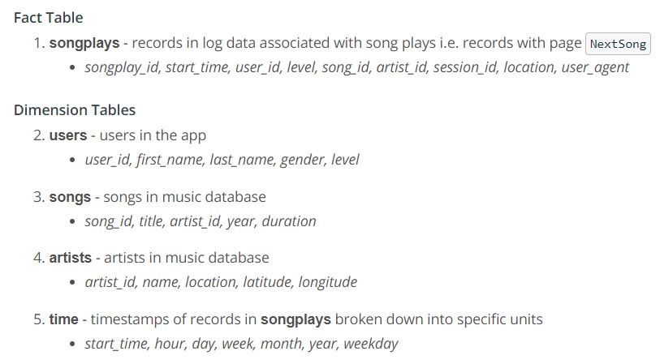

# Data Modeling with PostgreSQL
- This is one of the projects of my Udacity Data Engineer NanoDegree Program

## Introduction
A startup called Sparkify wants to analyze the data they've been collecting on songs and user activity on their new music streaming app. The analytics team is particularly interested in understanding what songs users are listening to. Currently, they don't have an easy way to query their data, which resides in a directory of JSON logs on user activity on the app, as well as a directory with JSON metadata on the songs in their app.

They'd like a data engineer to create a Postgres database with tables designed to optimize queries on song play analysis, and bring you on the project. Your role is to create a database schema and ETL pipeline for this analysis. You'll be able to test your database and ETL pipeline by running queries given to you by the analytics team from Sparkify and compare your results with their expected results.

## Project Description
We will define fact and dimension tables for a star schema for a particular analytic focus, and write an ETL pipeline that transfers data from files in two local directories into these tables in Postgres using Python and SQL.

## Schema for Song Play Analysis
Using the song and log datasets, we need to create a star schema optimized for queries on song play analysis. This includes the following tables.<br/>


## Dataset
The first dataset is a subset of real data from the Million Song Dataset. Each file is in JSON format and contains metadata about a song and the artist of that song. The files are partitioned by the first three letters of each song's track ID. For example, here are filepaths to two files in this dataset.
``` 
song_data/A/B/C/TRABCEI128F424C983.json
song_data/A/A/B/TRAABJL12903CDCF1A.json
```
The second dataset consists of log files in JSON format generated by event simulator based on the songs in the dataset above. These simulate activity logs from a music streaming app based on specified configurations.<br/>

The log files in the dataset you'll be working with are partitioned by year and month. For example, here are filepaths to two files in this dataset.<br/>
```
log_data/2018/11/2018-11-12-events.json
log_data/2018/11/2018-11-13-events.json
```
And below is an example of what the data in a log file, 2018-11-12-events.json, looks like.<br/>
<br/>


## Package required
```
import os
import glob
import psycopg2
import pandas as pd
```

## Implementation steps
1. run the create_tables.py to build the database sparkifydb and create tables
2. run the etl.py to connect to the databse and for the ETL process
3. test some of the result from the test jupyter notebook
